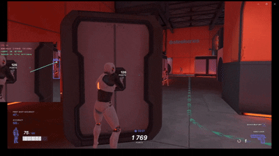
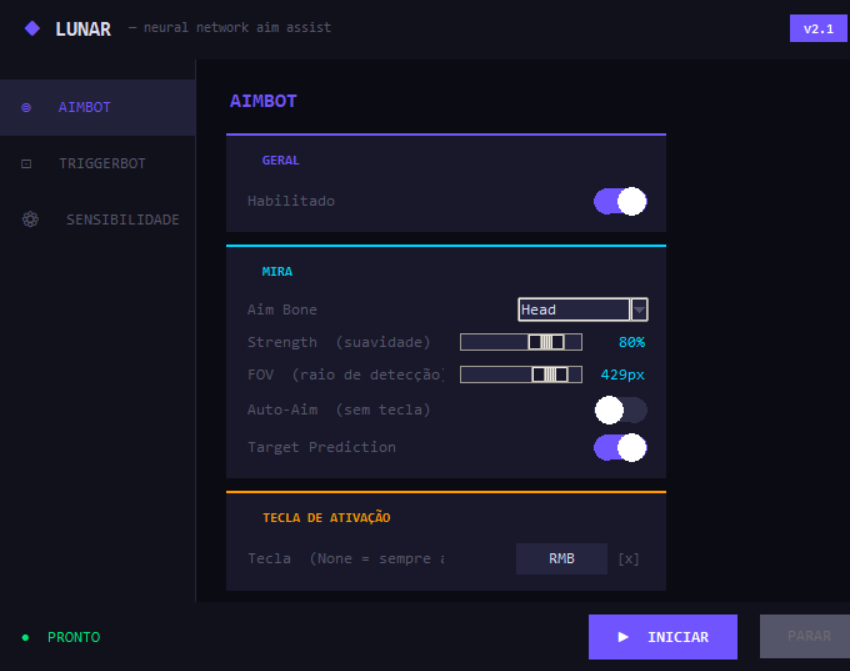

# Improved open Lunar 

An improved version of [zeyad-mansour/Lunar](https://github.com/zeyad-mansour/Lunar) — a neural network aim assist using real-time object detection with YOLOv5 and PyTorch.

---


---

## What's New

Compared to the original Lunar, this version adds:

- **Visual configuration menu** — no more editing config files manually
- **Triggerbot** with three modes: Toggle, Hold and Auto-Tap
- **Dedicated mouse thread** — mouse movement no longer blocks screen capture
- **Live sensitivity editor** — edit and save `config.json` directly from the menu
- **F2 returns to menu** instead of just quitting

---

## Menu



### Aimbot
- Enable / Disable
- Aim Bone — Head, Neck, Chest, Pelvis
- Strength — snap aggressiveness (1–100%)
- FOV — detection radius in pixels
- Auto-Aim and Target Prediction toggles
- Configurable keybind

### Triggerbot
- Enable / Disable
- Mode — Toggle, Hold or Auto-Tap
- Trigger Delay — ms before first shot
- Tap Interval — ms between shots in Auto-Tap mode
- Configurable keybind

### Sensitivity
- X/Y Sensitivity and Targeting Sensitivity sliders
- Calculated values (`xy_scale`, `targeting_scale`) shown in real time
- Saves to `config.json` automatically

---

## Requirements

- Windows 10/11
- Python 3.10
- NVIDIA GPU with CUDA (recommended)
- `lib/best.pt` — trained YOLOv5 model

---

## Installation

```bash
git clone https://github.com/AngeloMan/aimbot-with-computer-vision
cd aimbot-with-computer-vision
pip install -r requirements.txt
```

Place your `best.pt` model inside the `lib/` folder.

---

## Usage

```bash
python menu.py
```

Configure your settings and click **SAVE & LAUNCH**.

### Controls

| Key | Action |
|---|---|
| F2 | Exit |

---

## Project Structure

```
menu.py          ← Configuration menu
lunar.py         ← Entry point
lib/
├── aimbot.py    ← Core logic
├── best.pt      ← YOLOv5 model
└── config/
    ├── config.json    ← Sensitivity settings
    └── settings.json  ← Menu settings
```

---

## Credits

Based on [Lunar by zeyad-mansour](https://github.com/zeyad-mansour/Lunar).  
Original architecture: YOLOv5 by [Ultralytics](https://github.com/ultralytics/yolov5).

---

## License

[GNU General Public License v3.0](https://www.gnu.org/licenses/gpl-3.0.html)
